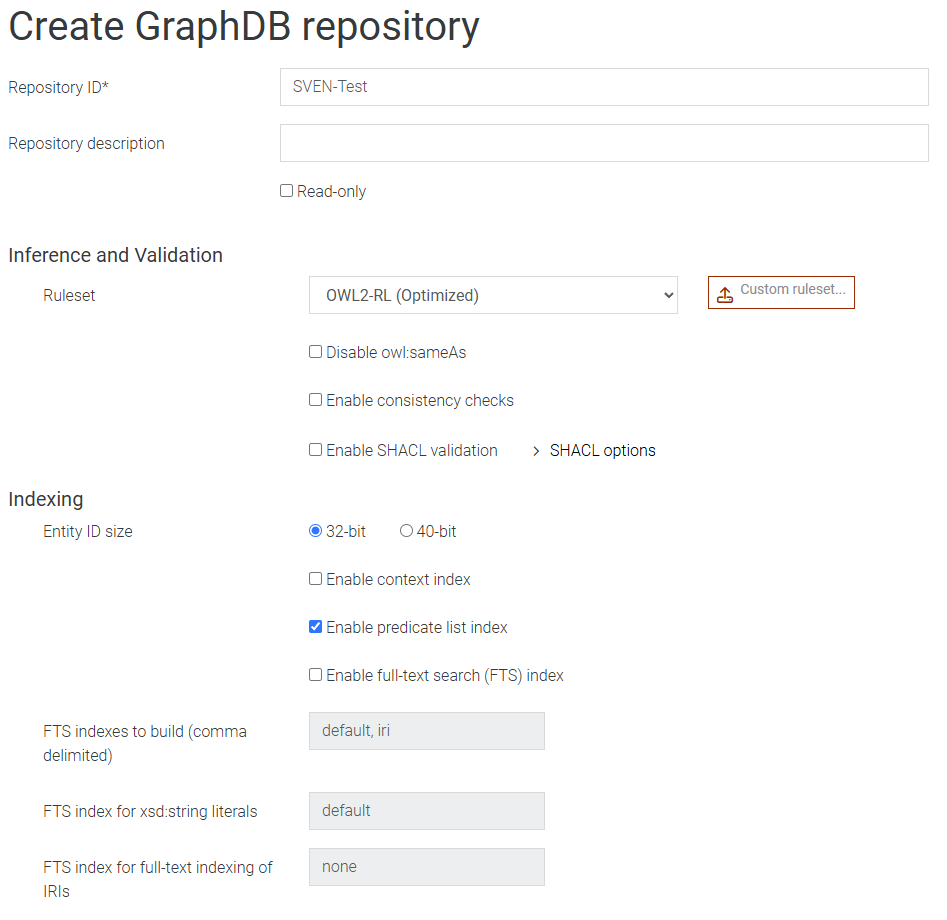
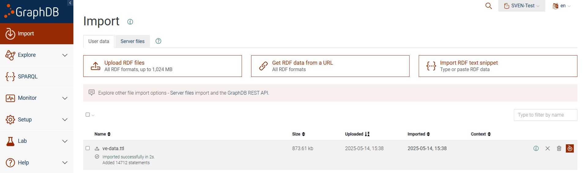

# Demonstration Guidelines

1. Go to the demo website: [https://sven.lisn.upsaclay.fr/](https://sven.lisn.upsaclay.fr/)
2. A menu will appear where you can choose between **Record** and **Replay**.

---

## Record

### Menu

1. In the **Record** menu, choose a scene name. This name will also appear in the **Replay** menu once the scene is recorded.
2. You can set a semantic logging frequency (default is 10Hz), meaning the scene will be recorded 10 times per second.
3. Press the **Play** button to start the selected scene.


---

### Scene

1. Move around the scene using **W, A, S, D** or the **arrow keys**. Jump with **Space**, crouch with **Control**.
2. Pick up/drop **pumpkins, carrots, apples, and bananas** using **F**.
3. Pick up/drop **paint bombs** to color interactive objects using **Left-Click** of your mouse.
4. Press **Escape** to open the **Pause** menu.


---

### Pause Menu

1. Adjust the **mouse sensitivity**.
2. Click **Resume** to return to the scene.
3. Click **Download turtle file** to download the scene’s Turtle file.
4. Click **Save & Quit** to save and exit the scene.


Once you're back in the main menu, you can replay the scene you just recorded.

---

## Replay

### Menu

1. In the "Replay" menu, you can select from scenes previously recorded by any user (only the **20 most recent** are shown).
2. Click the **Replay** button to start the selected scene.


---

### Scene

1. Replay the scene like a video using the playback interface at the bottom of the screen.
2. You can also click **Download turtle file** to download the Turtle file of the scene.
3. Press **Escape** to open the **Pause** menu.


---

### Pause Menu

1. Click **Resume** to return to the scene.
2. Click **Print result** to display performance metrics and identify key timestamps in the browser console.
3. Click **Download turtle file** to download the Turtle file of the scene.
4. Click **Quit** to exit the scene and return to the main menu.


## SPARQL Example

To try the query examples present in the article, you need to create a repository in GraphDB.

### GraphDB Repository Creation

1. Go to the **Repositories** tab and click on the **Create** button.
2. Make sure to select the **OWL2-RL** ruleset.
3. Create the repository with the name of your choice (e.g., **sven**).
4. Click on the **Create** button to finalize the repository creation.



### Uploading Virtual Environment Turtle Files

1. Go to the **Import** tab.
2. Click on the **Upload RDF files** button and select the Turtle file you want to upload.
3. Click on the **Import** button to upload the Turtle file.



### Try the SPARQL Queries

1. Go to the **SPARQL** tab.
2. Copy and paste the SPARQL query you want to try into the query editor.

```sparql
PREFIX ofn: <http://www.ontotext.com/sparql/functions/>
PREFIX rdfs: <http://www.w3.org/2000/01/rdf-schema#>
PREFIX time: <http://www.w3.org/2006/time#>
PREFIX sven: <https://sven.lisn.upsaclay.fr/entity/>

SELECT ?objectType (SUM(?totalSeconds) AS ?sumSeconds)
WHERE {
	?user a sven:User ;
		  sven:pointOfView ?pov .
	?lookEvent a sven:Event ;
			   sven:sender ?pov ;
			   sven:receiver ?lookedObject ;
			   time:hasTemporalExtent/time:hasXSDDuration ?duration .
	?lookedObject a ?objectType .
	?objectType rdfs:subClassOf sven:Food .
	BIND(ofn:asMillis(?duration) / 1000 AS ?totalSeconds)
}
GROUP BY ?objectType
ORDER BY DESC(?sumSeconds)
```

3. Click on the **Run** button to execute the query.
4. The results will be displayed in the results table below the query editor.


