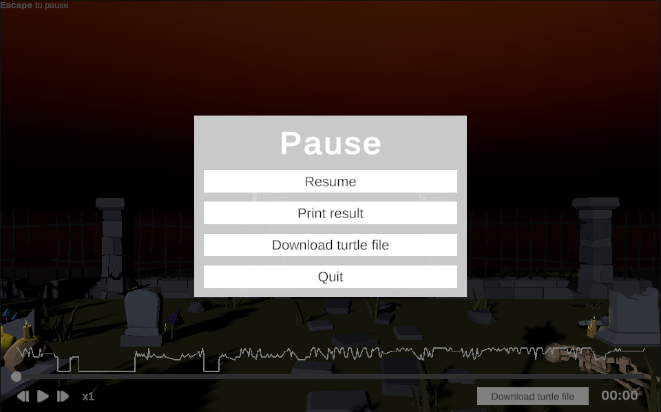

# Demonstration Guidelines

1. Go to the demo website: [https://sven.lisn.upsaclay.fr/](https://sven.lisn.upsaclay.fr/)
2. A menu will appear where you can choose between **Record** and **Replay**.

---

## Record

### Menu

1. In the **Record** menu, choose a scene name. This name will also appear in the **Replay** menu once the scene is recorded.
2. You can set a semantic logging frequency (default is 10Hz), meaning the scene will be recorded 10 times per second.
3. Press the **Play** button to start the selected scene.

---

### Scene

1. Move around the scene using **W, A, S, D** or the **arrow keys**. Jump with **Space**, crouch with **Control**.
2. Pick up/drop **pumpkins, carrots, apples, and bananas** using **F**.
3. Pick up/drop **paint bombs** to color interactive objects using **Left-Click** of your mouse.
4. Press **Escape** to open the **Pause** menu.

---

### Pause Menu

1. Adjust the **mouse sensitivity**.
2. Click **Resume** to return to the scene.
3. Click **Download turtle file** to download the scene’s Turtle file.
4. Click **Save & Quit** to save and exit the scene.

Once you're back in the main menu, you can replay the scene you just recorded.

---

## Replay

### Menu

1. In the "Replay" menu, you can select from scenes previously recorded by any user (only the **20 most recent** are shown).
2. Click the **Replay** button to start the selected scene.

---

### Scene

1. Replay the scene like a video using the playback interface at the bottom of the screen.
2. You can also click **Download turtle file** to download the Turtle file of the scene.
3. Press **Escape** to open the **Pause** menu.

---

### Pause Menu

1. Click **Resume** to return to the scene.
2. Click **Print result** to display performance metrics and identify key timestamps in the browser console.
3. Click **Download turtle file** to download the Turtle file of the scene.
4. Click **Quit** to exit the scene and return to the main menu.
