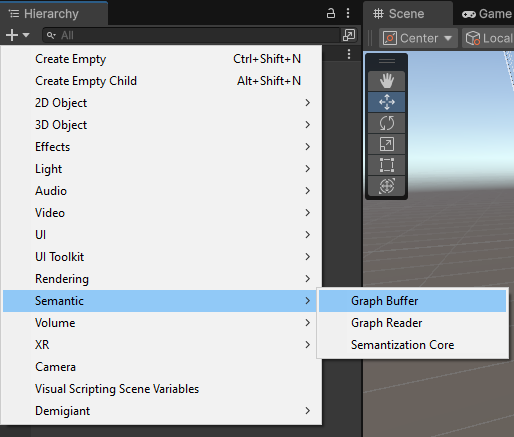

# Semantized Virtual ENvironment (SVEN) for Unity

[](https://unity3d.com/get-unity/download)

<!---[](https://openupm.com/packages/com.dbrizov.naughtyattributes/)-->
<!---[](https://github.com/dbrizov/NaughtyAttributes/blob/master/LICENSE)-->

SVEN is a Unity package that allows you to semantize your Virtual Environment (VE) into a knowledge graph, making it possible to perform complex queries on your VE during the experience, as well as the ability to replay and analyze it afterwards.

It is based on [Semantic Web](https://en.wikipedia.org/wiki/Semantic_Web) and [Linked Data](https://en.wikipedia.org/wiki/Linked_data) technologies and uses the [SPARQL](https://en.wikipedia.org/wiki/SPARQL) query language to query the data. Using such technology enriches your virtual experience in several ways:

1. **Rule-based reasoning**: By using semantic rules, you can infer new information from existing data, especially if you have a complex domain or incomplete data.
2. **Data interoperability**: By using open standards and linked data, SVEN facilitates the integration and exchange of data between different systems and platforms.
3. **Computation delegation**: SVEN allows you to delegate complex computations to a remote server, saving local resources, which is particularly beneficial for VR/AR applications where resources are often limited.

## System Requirements

Unity **6000.0** or later versions.

## Installation

1. The package is available in **Releases** section. You can download the latest version from [here](https://gitlab.lisn.upsaclay.fr/nsaintl/SVENUnity/-/releases/permalink/latest), then import it into your Unity project.

2. You can also install via git url by adding this entry in your **manifest.json**

```
"com.***.***": "https://gitlab.lisn.upsaclay.fr/nsaintl/SVENUnity.git#upm"
```

If you don't have openUPM CLI, you will need to install it first by following the instructions [here](https://openupm.com/docs/getting-started.html), or by adding this entry in your **manifest.json**. This step is important, otherwise the dependencies will not install properly.

```json
{
    "scopedRegistries": [
        {
            "name": "package.openupm.com",
            "url": "https://package.openupm.com",
            "scopes": ["com.gamesoft.dotween", "com.dbrizov.naughtyattributes"],
            "overrideBuiltIns": false
        }
    ]
}
```

## Support

This project is developed as part of a PhD thesis at the LISN laboratory of the University of Paris-Saclay. For any questions, you can contact [Nicolas Saint-Léger](mailto:nicolas.saint-leger@universite-paris-saclay.fr).

# Overview

## Semantize your Virtual ENvironment (VE) _(write your knowledge graph)_

Pour créer un environnement virtuel semantisé, il suffit de suivre les étapes suivantes :

1. Ajouter dans votre scène un composant **GraphBuffer** (GameObject > SVEN > GraphBuffer) qui permet de stocker les données de votre environnement virtuel sous forme de graphe de connaissance et de les envoyer à un serveur distant (ou un fichier local) pour pouvoir l'analyser ou le rejouer plus tard.



2.


// explication du graph buffer et de toute ses propriétés (référencé au différentes sections ci-dessous enfonction de local/remote)

// explication du SemantizationCore, du fait qu'il scan les composants et les propriétés, et que l'on peut ajouter/supprimer des composants à la volée

// parler du tradeoff entre la quantité de propriété observer et la fréquence de sémantisations

### Local

// dire que ça sauvegarde un fichier .ttl dans un dossier spécifique du projet

### Remote

// dire que ça envoie les données sur un serveur distant configurer dans le graphbuffer

## Replay your Semantize Virtual ENvironment (SVEN) _(read your knowledge graph)_

// lancer la scene **Scene Reader**

### Local

// toucher au composant **GraphReader** mettre en local -> charger un fichier .ttl

### Remote

## How to support new components ?

To support non-generic components, you can add their descriptions to the `MapppedComponents` dictionary. For example, to add a description for the `Atom` component, you can use the following code:

```csharp
MapppedComponents.AddComponentDescription(typeof(Atom), new("Atom",
    new List<Delegate>
    {
        (Func<Atom, PropertyDescription>)(atom => new PropertyDescription("enabled", () => atom, value => atom.enabled = value.ToString() == "true", 1)),
        (Func<Atom, PropertyDescription>)(atom => new PropertyDescription("atomType", () => atom, value => atom.type = value.ToString(), 1)),
    }));
```

This code snippet maps the `Atom` component to its properties, allowing SVEN to semantize and interact with it properly. It also enables custom getters and setters for observing their properties. Make sure to call this at the beginning of the scene to ensure everything works correctly.

<style>
img {
    display: block;
    margin: auto;
}
</style>
