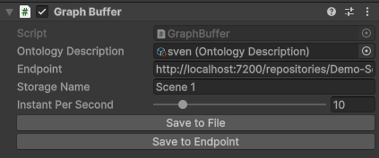
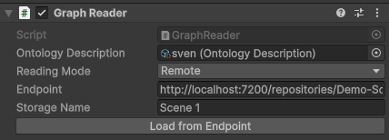

# Semantized Virtual ENvironment (SVEN) for Unity

[](https://unity3d.com/get-unity/download)

<!---[](https://openupm.com/packages/com.dbrizov.naughtyattributes/)-->
<!---[](https://github.com/dbrizov/NaughtyAttributes/blob/master/LICENSE)-->

SVEN is a Unity package that allows you to semantize your Virtual Environment (VE) into a knowledge graph, making it possible to perform complex queries on your VE during the experience, as well as the ability to replay and analyze it afterwards.

It is based on [Semantic Web](https://en.wikipedia.org/wiki/Semantic_Web) and [Linked Data](https://en.wikipedia.org/wiki/Linked_data) technologies and uses the [SPARQL](https://en.wikipedia.org/wiki/SPARQL) query language to query the data. Using such technology enriches your virtual experience in several ways:

1. **Rule-based reasoning**: By using semantic rules, you can infer new information from existing data, especially if you have a complex domain or incomplete data.
2. **Data interoperability**: By using open standards and linked data, SVEN facilitates the integration and exchange of data between different systems and platforms.
3. **Computation delegation**: SVEN allows you to delegate complex computations to a remote server, saving local resources, which is particularly beneficial for VR/AR applications where resources are often limited.

## System Requirements

Unity **2022.3** or later versions.

## Installation

1. The package is available in **Releases** section. You can download the latest version from [here](https://gitlab.lisn.upsaclay.fr/nsaintl/SVENUnity/-/releases/permalink/latest), then import it into your Unity project.

2. You can also install via git url by adding this entry in your **Packages/manifest.json**

```
"com.nsaintl.sven": "https://gitlab.lisn.upsaclay.fr/nsaintl/SVENUnity.git#upm"
```

If you don't have openUPM CLI, you will need to install it first by following the instructions [here](https://openupm.com/docs/getting-started.html), or by adding this entry in your **Packages/manifest.json**. This step is important, otherwise the dependencies will not install properly.

```json
{
    "scopedRegistries": [
        {
            "name": "package.openupm.com",
            "url": "https://package.openupm.com",
            "scopes": ["com.gamesoft.dotween", "com.dbrizov.naughtyattributes"],
            "overrideBuiltIns": false
        }
    ]
}
```

## Support

This project is developed as part of a PhD thesis at the LISN laboratory of the University of Paris-Saclay. For any questions, you can contact [Nicolas Saint-Léger](mailto:nicolas.saint-leger@universite-paris-saclay.fr).

# Overview

## Semantize your Virtual ENvironment (VE) _(write your knowledge graph)_

To create a semantized virtual environment, follow these steps:

1. Add a **GraphBuffer** component to your scene (GameObject > Semantic > GraphBuffer). This component stores your virtual environment data as a knowledge graph and sends it to a remote server (or a local file) for later analysis or replay.


2. Configure the **GraphBuffer** component according to your needs:

| Property                 | Description                                                                                                                            |
| ------------------------ | -------------------------------------------------------------------------------------------------------------------------------------- |
| **Endpoint**             | The URL of the remote server where the data will be sent (or the path of the local file where the data will be saved)                  |
| **Storage Name**         | The name of the knowledge graph that will be created on the remote server (or the name of the local file where the data will be saved) |
| **Instant Per Second**   | The frequency at which the virtual environment data will be checked and saved in the knowledge graph                                   |
| **Ontology Description** | The description of the ontology used to describe the virtual environment data                                                          |



3. Create an **OntologyDescription** resource in your project (Create > Semantic > OntologyDescription) to describe the ontology configuration used for your virtual environment data.


4. Configure the **OntologyDescription** resource according to your needs:

| Property          | Description                                                                                           |
| ----------------- | ----------------------------------------------------------------------------------------------------- |
| **Name**          | The name of the ontology used to describe the virtual environment data                                |
| **Base Uri**      | The base URI used to describe the virtual environment data                                            |
| **Namespaces**    | The namespaces used to describe the virtual environment data                                          |
| **Ontology File** | The **_.ttl_** file containing the ontology description used to describe the virtual environment data |


5. Add a **SemantizationCore** component to each object you want to semantize (GameObject > Semantic > SemantizationCore). This component scans the object's components, allowing you to select which properties to observe and modify. You can also choose whether the component should be dynamically observed or considered static and semantized only at creation.


6. Your scene is now ready to be semantized. You can run your application and observe the data from your virtual environment being saved into the knowledge graph at the end of your experience.

The **_.ttl_** files are saved in the **SVENs** folder at the root of your project.

## Replay your Semantize Virtual ENvironment (SVEN) _(read your knowledge graph)_

To replay a semantized virtual environment, follow these steps:

1. Download the **Replay Semantized Virtual Environment** sample and open the **Replay SVEN** scene.

2. Select the **Reader** object in the scene hierarchy and configure the **GraphReader** component according to your needs. This component reads the knowledge graph data and applies it to your virtual environment, allowing you to fully recreate a previously recorded experience. The component can read data from a local file or a remote server depending on the chosen configuration:

### Remote

| Property         | Description                                                       |
| ---------------- | ----------------------------------------------------------------- |
| **Endpoint**     | The URL of the remote server where the data will be read          |
| **Storage Name** | The name of the knowledge graph that will be read from the server |



### Local

In local mode, once the scene is launched, simply press the **Load Graph from file** button to load a **_.ttl_** file containing the knowledge graph data.


3. And that's it! You can now navigate through your virtual environment as it was previously recorded.


## How to support new components ?

To support non-generic components, you can add their descriptions to the `MapppedComponents` dictionary. For example, to add a description for the `Atom` component, you can use the following code:

```csharp
MapppedComponents.AddComponentDescription(typeof(Atom), new("Atom",
    new List<Delegate>
    {
        (Func<Atom, PropertyDescription>)(atom => new PropertyDescription("enabled", () => atom, value => atom.enabled = value.ToString() == "true", 1)),
        (Func<Atom, PropertyDescription>)(atom => new PropertyDescription("atomType", () => atom, value => atom.type = value.ToString(), 1)),
    }));
```

This code snippet maps the `Atom` component to its properties, allowing SVEN to semantize and interact with it properly. It also enables custom getters and setters for observing their properties. Make sure to call this at the beginning of the scene to ensure everything works correctly.
